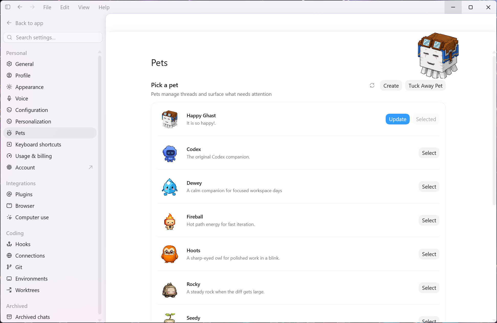
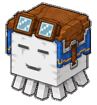
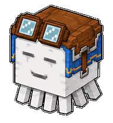
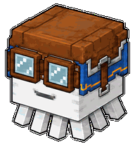
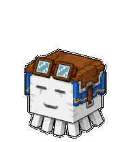

# Happy Ghast - Codex Desktop & Web Pet

[中文](#-中文指南) | [English](#-english-guide)

---

<a id="-中文指南"></a>
## 中文指南

一款专为 Codex 打造的可爱 Happy Ghast（快乐恶魂）桌面与网页端宠物！

### 🎨 效果预览

#### Codex 宠物页面截图


#### 动画效果
| 待机 (Idle) | 打招呼 (Hi) | 戴眼镜 (Goggles) | 漂浮 (Float) |
| :---: | :---: | :---: | :---: |
|  |  |  |  |

---

### 🚀 安装与使用

#### 🖥️ 桌面端安装方案
1. 将 `happy-ghast` 文件夹直接复制或拖入以下路径即可使用：
   ```text
   C:\Users\username\.codex\pets
   ```
   *（或者 Codex 桌面端宠物页面提示的对应路径）*

2. **更换不同设计 / 可替换 Spritesheet：**
   你可以将 `spritesheets/happy-ghast-pet-web-v1.webp` 改名并替换 `happy-ghast/spritesheet.webp`，即可体验另一种外观设计。

#### 🌐 网页端安装方案
1. 打开 Codex 网页端，导航至：**设置 -> 个性化 -> 宠物 -> 上传宠物**。
2. 直接上传 `spritesheets` 文件夹中的图片即可使用。

---

### ⚖️ 版权与声明
- **Happy Ghast** 属于 **Minecraft** (Mojang Studios / Microsoft)。
- 本仓库中的图片资源由 **Codex** 生成。

---

<a id="-english-guide"></a>
## English Guide

A cute Happy Ghast pet designed for both Codex Desktop and Web!

### 🎨 Previews

#### Codex Pet Interface Screenshot


#### Animations
| Idle | Say Hi | Goggles | Float |
| :---: | :---: | :---: | :---: |
|  |  |  |  |

---

### 🚀 Installation & Usage

#### 🖥️ Desktop Installation
1. Copy or drag the `happy-ghast` folder directly into:
   ```text
   C:\Users\username\.codex\pets
   ```
   *(or the directory indicated on your Codex desktop pet page).*

2. **Switching Design Variants:**
   You can rename `spritesheets/happy-ghast-pet-web-v1.webp` to `spritesheet.webp` and replace `happy-ghast/spritesheet.webp` to use an alternative design.

#### 🌐 Web Installation
1. Open Codex Web and navigate to: **Settings -> Personalization -> Pet -> Upload Pet**.
2. Upload any image directly from the `spritesheets` folder to use it.

---

### ⚖️ Credits & Disclaimer
- **Happy Ghast** belongs to **Minecraft** (Mojang Studios / Microsoft).
- Pet images in this repository were generated by **Codex**.
